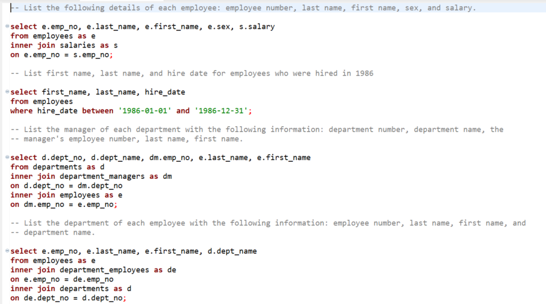
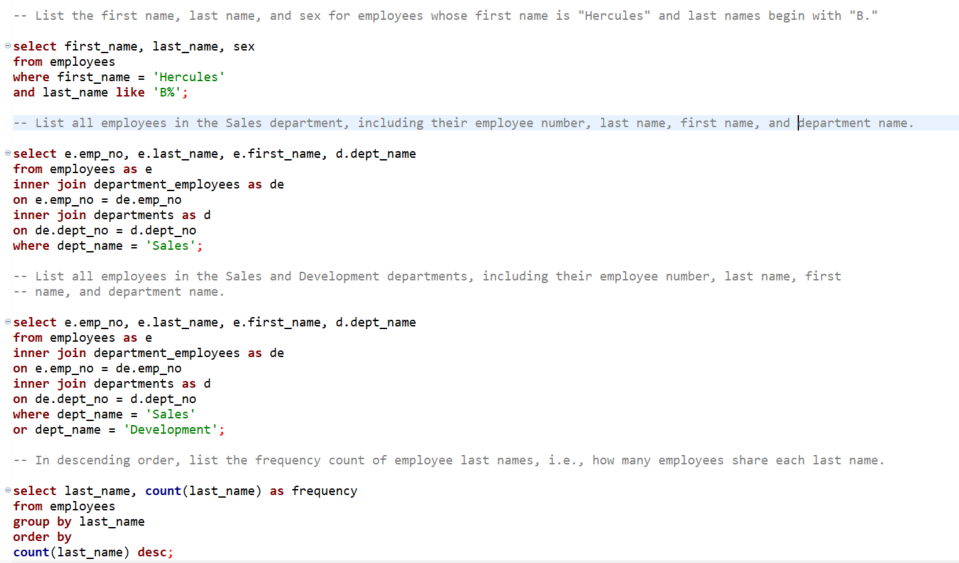

# SQL - Employee Database

## Background

This is a research project analyzing a company's employees from the 1980s and 1990s. The data is contained in six CSV files.

I designed the tables to hold the CSVs and importd them for analysis.

## Instructions

#### Data Modeling

I inspected the CSVs and sketched out an ERD of the tables using the program Quick Database Diagrams.

#### Data Engineering

* I created a table schema for each of the six CSV files. 

#### Data Analysis

I performed the following analysis:

1. List the following details of each employee: employee number, last name, first name, sex, and salary.

2. List first name, last name, and hire date for employees who were hired in 1986.

3. List the manager of each department with the following information: department number, department name, the manager's employee number, last name, first name.

4. List the department of each employee with the following information: employee number, last name, first name, and department name.

5. List first name, last name, and sex for employees whose first name is "Hercules" and last names begin with "B."

6. List all employees in the Sales department, including their employee number, last name, first name, and department name.

7. List all employees in the Sales and Development departments, including their employee number, last name, first name, and department name.

8. In descending order, list the frequency count of employee last names, i.e., how many employees share each last name.

